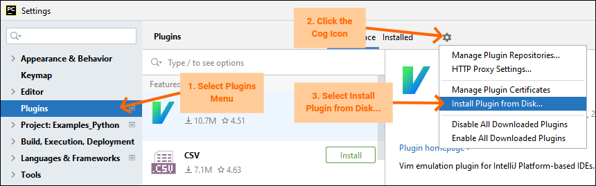

2. Installation
================

To install the plugin, you need *Pycharm 2022.2* or newer.

**Installation from the Marketplace:**

Same thing, go to menu *File -> Settings -> Plugins* and choose the Tab *Marketplace*:

.. image:: images/menu_install_from_marketplace.png

Type the search text, for example 'rohde', and hit install.

.. hint::

	If you do not see the plugin listed, you have a Pycharm version older than **2022.2**.
	Update your Pycharm first, and repeat the process.

After that, you have to restart the Pycharm IDE.

**Installation from a local File:**

In Pycharm, go to menu *File -> Settings -> Plugins* and choose *Install Plugin from Disk*:

Select the zip file with the plugin, e.g.: ``RsConnectivityPycharmPlugin-1.0.1.zip``

After that, you have to restart the Pycharm IDE.

.. warning::
    
    **Do not unpack the .ZIP file!!!** Select the **.ZIP** file for the installation.
    Pycharm allows you to also select the included **.JAR** files, but the plugin will not work properly.
