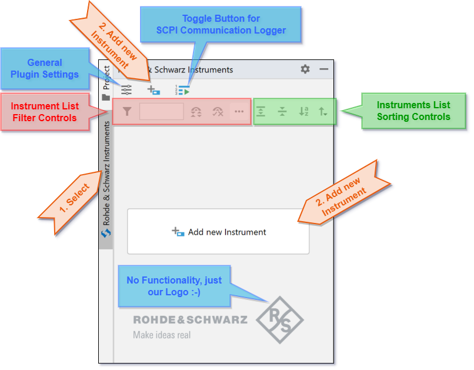

.. _main-instrument-panel:

3. Main Instruments Panel
==========================

When you start the Pycharm IDE with the RsIC plugin installed, the IDE shows an additional Tool Window `Rohde & Schwarz Instruments`.
Click on the Tool Window gutter to open it (orange description):

.. hint::
    You might experience a situation, where the tab *Rohde & Schwarz Instruments* is not available.
    In such case, you can always open it in the Pycharm menu *View->Tool Windows->Rohde & Schwarz Instruments*

