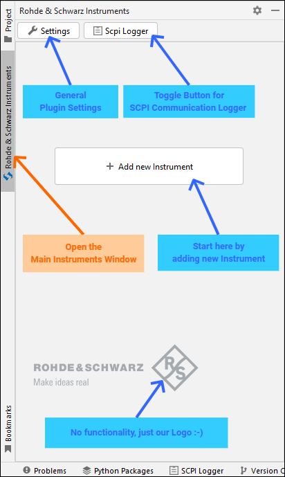

.. _main-instrument-panel:

3. Main Instruments Panel
==========================

When you start the Pycharm IDE with the RsIC plugin installed, the IDE shows an additional Tool Window `Rohde & Schwarz Instruments`.
Click on the Tool Window gutter to open it (orange part):

