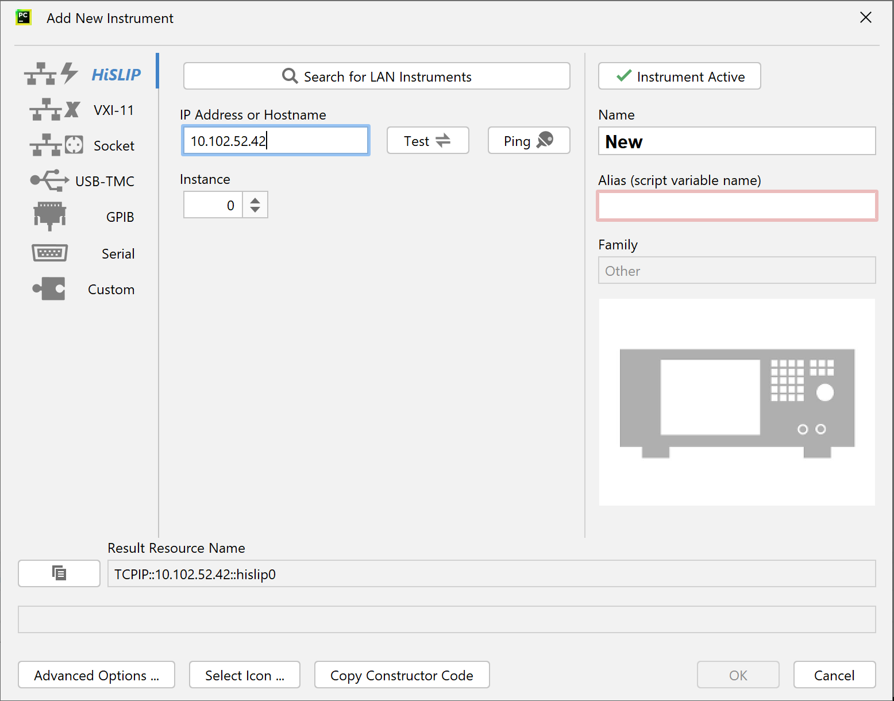
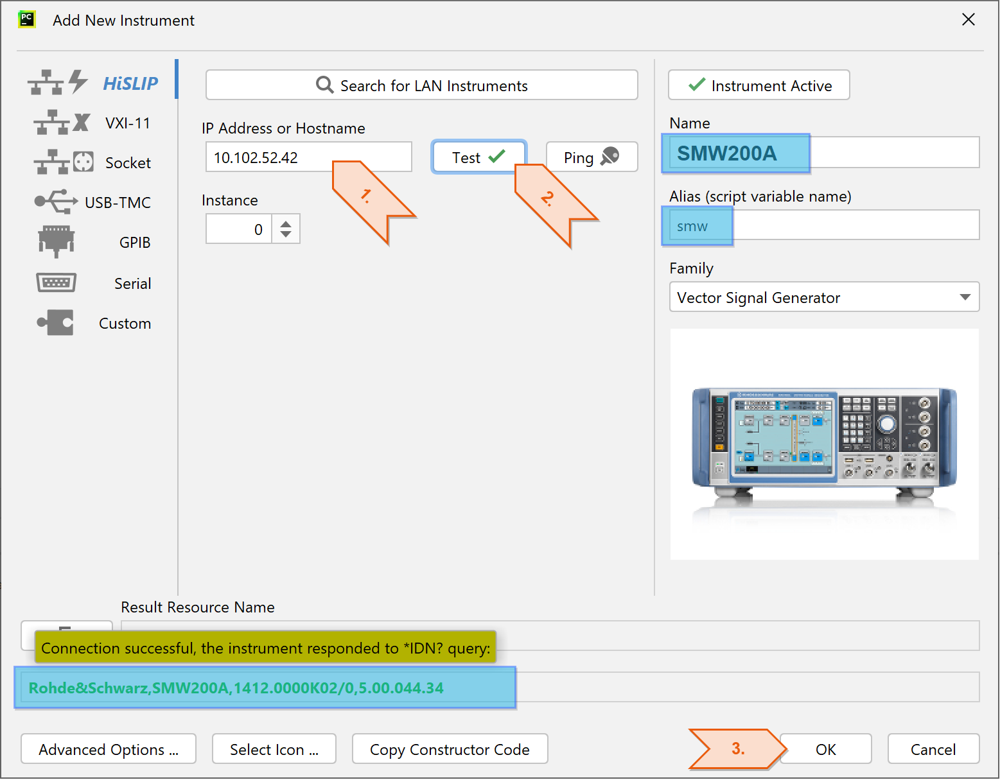
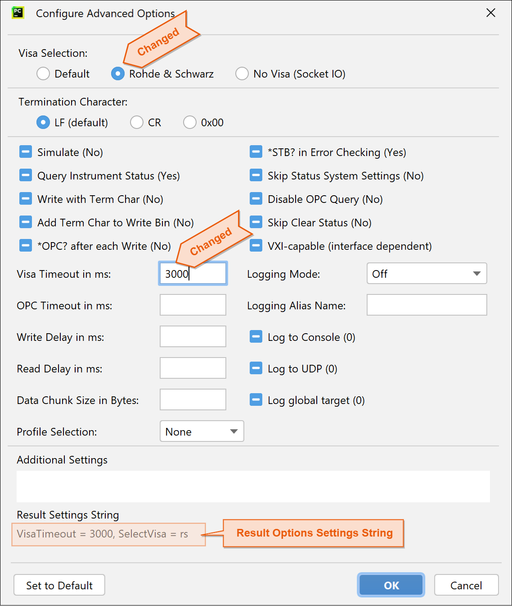
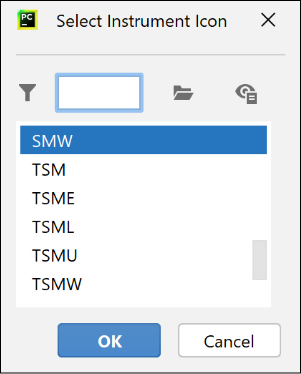

.. _adding-your-first-instrument:

4. Adding your first Instrument
================================

Click on ``+Add new Instrument`` button (either one), and the following dialog comes up:

We add a typical LAN instrument over HiSLIP. If you wish to switch the session type to VXI-11 or USB-TMC, do so with the tab selector on the left side.

Enter the IP Address or the computer name and hit the **Test** button. If the instrument connection worked, the plugin fills out all other fields for you:

Name, Alias, Icon Picture come pre-filled with the values parsed from the instrument's IDN response.
Take notice of the **Alias** - it has to be unique in your list of instruments.
With this string, in our case ``smw``, we are going to reference our instrument from python scripts.

.. tip::
    If you want to use the same alias with more than one instrument, you can only have one of them active at the same time. Change it with the button **Instrument Active**.
    Inactive instruments work just like the active ones, except of SCPI auto-completion in your python scripts. There, the SCPI auto-completion relates only to the currently active instruments.

.. tip::
    If your LAN connection does not work, try to use the **Ping** button to see whether the instrument is available on LAN.
    Searching for LAN instruments only works in certain scenarios. If your instrument does not appear in the found list, it does not necessary mean that it is not available.
    The Search feature is very helpful with USB-TMC instruments, where it finds all that are available:

    .. image:: images/RsIc-instrument_search_usbtmc.drawio.png

**Advanced Options** button allows you select additional settings for your session, like VISA selection (we hope you use R&S VISA :-), VISA Timeout, Logging mode, etc... :

You can also adjust the icon picture or even add your own custom picture with the button **Select Icon** (or single-click on the current icon picture).
If possible, use the format 640x480:

.. note::
    Settings in this configuration dialog results in a Python code snippet for RsInstrument that you can copy to clipboard by hitting the button **Copy Constructor Code**.
    Then, you can use it in your python script to initialize the connection:

    .. code-block:: python

        smw = RsInstrument('TCPIP::10.102.52.42::hislip0', reset=False, options='VisaTimeout = 3000, SelectVisa = rs')
