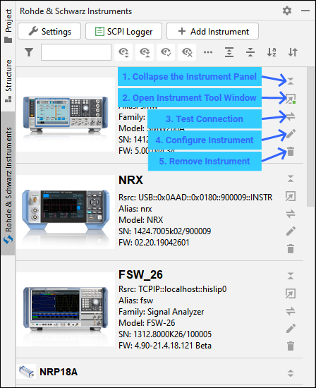

.. _instrument-panel-list:

5. Instruments Panel List
==========================

Instruments Panels List (IPL) serves as an overview of all your instrument, and as a launchpad for a dedicated Instrument Tool Windows for each instrument:

Example of the IPL:

Description of the controls:

1. **General Plugin Settings** - contains all the settings for the plugin, see the chapter :ref:`plugin-settings`.
2. **SCPI Logger Toggle** - opens/closes SCPI Logger Tool Window. It logs the entire communication with your instrument coming from the plugin, and optionally your python script (for that, you need to switch on logging to UDP - see the `RsInstrument Logging help <https://rsinstrument.readthedocs.io/en/latest/StepByStepGuide.html#logging>`_).
3. **Open Instrument Tool Window** - opens dedicated Instrument Tool Window (ITW) with all the functions for the instrument. See the :ref:`instrument-tool-window`.
4. **Test Connection** - tests, whether the connection to your instrument can be established. The connection is closed afterwards.
5. **Configure Instrument** - Opens the instrument's configuration dialog described in :ref:`adding-your-first-instrument`.
6. **Delete Instrument** - removes the instrument from the list (with confirmation).

.. tip::
    You can adjust the order by drag-and-drop:

    .. image:: images/instrument_list_drag_drop.png

.. tip::
    Adjust the look and feel in General Plugin Settings:

    .. image:: images/general_settings_invoke.png

    |

    .. image:: images/plugin_settings_instr_panels.png

    |

    This makes your list looking like this:

    .. image:: images/instrument_panel_list_compact.png

.. tip::
    You can reach all the functionality through the context menu, right-click on the instrument picture, and select the **Open in dedicated Window**:

    .. image:: images/instrument_panel_context_menu_open_itw.png

    |

    **Open in dedicated Window** is only available if you have made at least one successful connection to your instrument, because the plugin needs to know its identification string.
