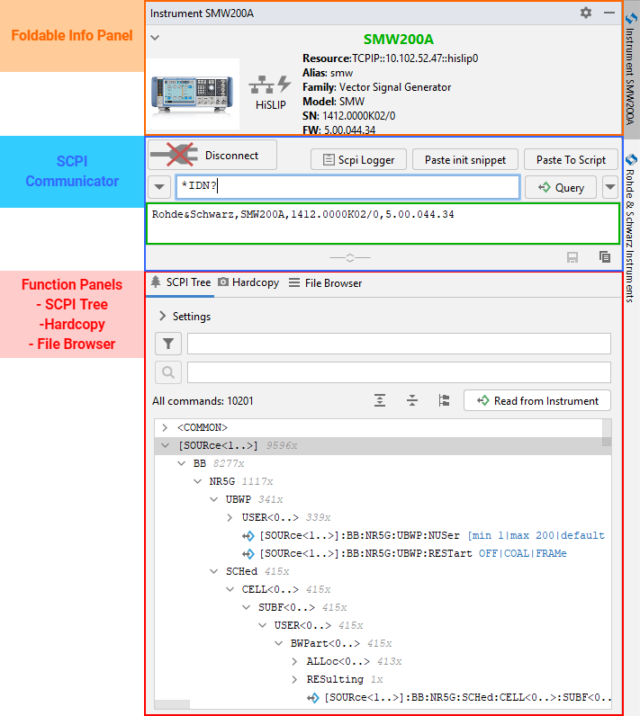
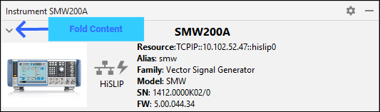
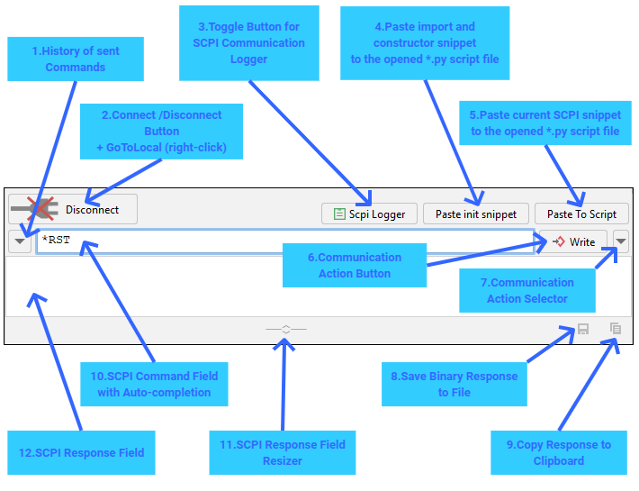

.. _instrument-tool-window:

6. Instrument Tool Window
==========================

Instrument Tool Window (ITW) provides all the features that are available for the instrument.

Foldable Info Panel
""""""""""""""""""""

The Info panel serves as a header for the Instrument Tool Window. It contains all the important information about your instrument.
If you wish to win more space, you can fold it:

.. hint::
    Click on the instrument's icon to quickly open its Configuration Dialog Window.

.. _scpi-communicator:

SCPI Communicator
""""""""""""""""""

SCPI Communicator contains controls for connecting and communicating with your instrument. The connection status is valid for all other functions in this window.

Description of the controls:

1. **History of Sent Commands** - keeps list of all the commands used in the past, plus standard commands. Right-click to delete the history items.
2. **Connect/Disconnect Button** - toggle button for connecting and disconnecting to the instrument. When connected, multiple functions of the ITW become available. Right-click allows for sending GoToLocal or GoToRemote signal.
3. **SCPI Logger Toggle Button** - opens/closes SCPI Logger Tool Window. The Logger logs entire communication with your instrument coming from the plugin, and optionally from your python script (for that, you need to `switch on logging to UDP <https://rsinstrument.readthedocs.io/en/latest/StepByStepGuide.html#logging>`_)
4. **Paste import and constructor snippet** - pastes an RsInstrument import statement, plus the instrument's constructor snippet to your currently opened python script.
5. **Paste current SCPI snippet** - adding the selected write/query operation to your currently opened python script. For example: ``smw.write('*RST')``. You can see the preview of the snippet and the paste position when you hover over the button.
6. **Communication Action Button** - sends/queries the current SCPI command (Field 10) to the instrument. The button changes its function based on the command type (write/query). Additionally, you can select the mode with the Field 7.
7. **Communication Action Selector** - select the type of write/query action - standard, with OPC, query binary data. The setting is persistent.
8. **Save Binary Response to File** - this button is enabled, when you have received a binary response from the instrument.
9. **Copy Response to Clipboard** - enabled when the SCPI Response Field (Field 12) is non-empty.
10. **SCPI Command Field with Auto-completion** - write your SCPI command here. If your instrument has a SCPI Tree available (see :ref:`function-panel-scpi-tree`), this field offers you auto-completion for SCPI commands.
11. **SCPI Response Field Resizer** - change the height of the response field to fit your needs.
12. **SCPI Response Field** - text field that contains responses received from the instrument.
