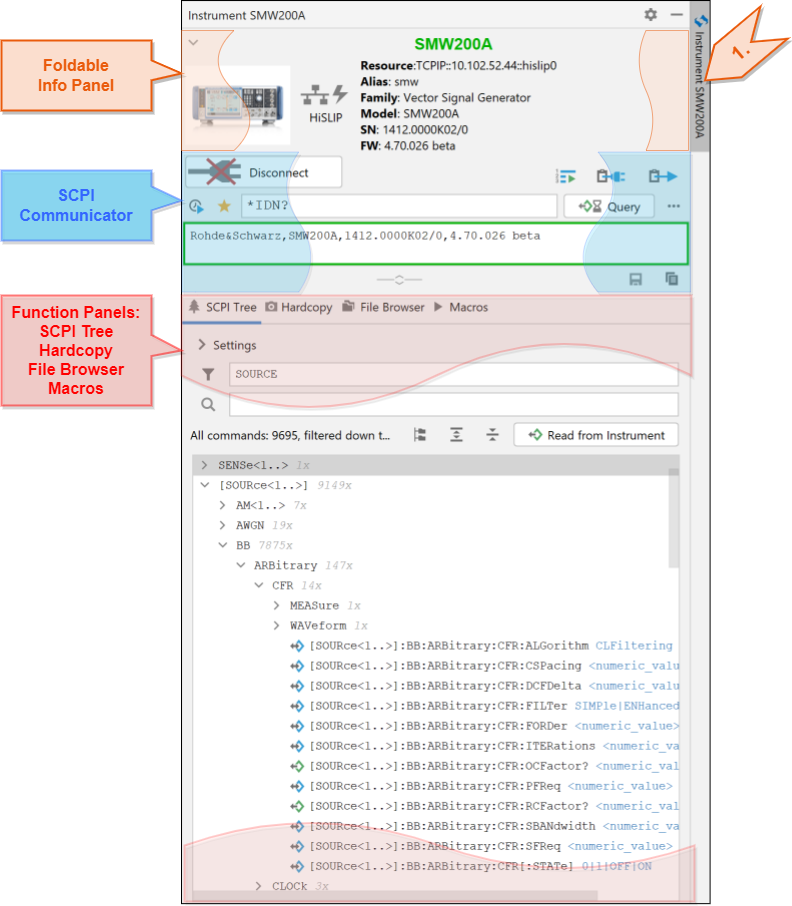
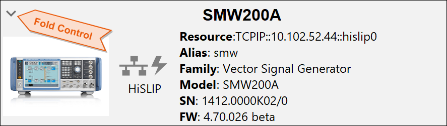
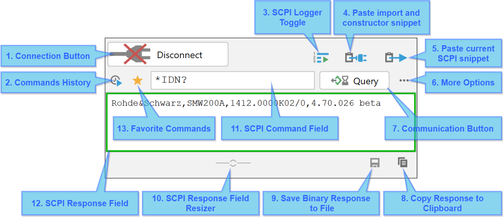
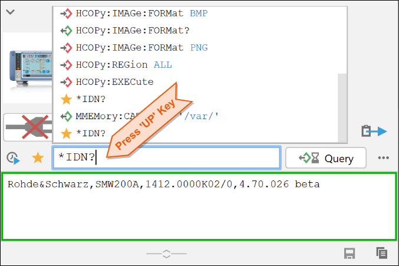
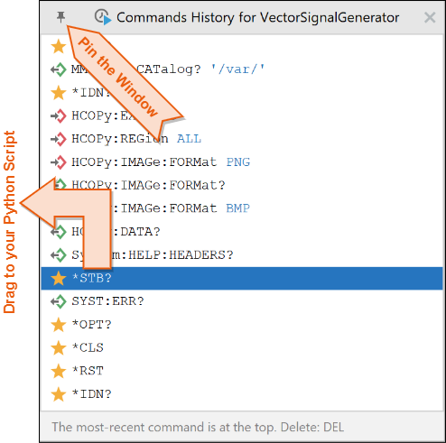
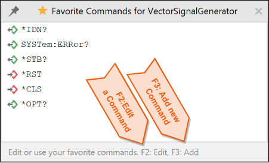

6. Instrument Tool Window
==========================

Instrument Tool Window (ITW) provides all the features that are available for the instrument.

Foldable Info Panel
""""""""""""""""""""

The Info Panel serves as a header for the Instrument Tool Window. It contains all the important information about your instrument.
If you wish to win more vertical space, you can fold it:

.. hint::
    Click on the instrument's icon to quickly open its Configuration Dialog Window.

.. _scpi-communicator:

SCPI Communicator
""""""""""""""""""

SCPI Communicator contains controls for connecting and communicating with your instrument. The connection status is valid for all other functions in the entire ITW.

Description of the controls:

1. **Connection Button** - toggle button for connecting and disconnecting to the instrument. When connected, multiple functions of the ITW become available. Right-click allows for sending GoToLocal or GoToRemote signal, Reset or setting VISA Timeout.
2. **Commands History** - keeps list of all the commands used in the past. Invoke the quick version of the window by pressing **UP** key in the SCPI Command Field. The full version you can invoke with **F4** or pressing **DOWN** in the SCPI Command Field (11).
3. **SCPI Logger Toggle** - opens/closes SCPI Logger Tool Window. The Logger logs entire communication with your instrument coming from the plugin, and optionally from your python script (for that, you need to `switch on logging to UDP <https://rsinstrument.readthedocs.io/en/latest/StepByStepGuide.html#logging>`_)
4. **Paste import and constructor snippet** - pastes an RsInstrument import statement, plus the instrument's constructor snippet to your currently opened python script.
5. **Paste current SCPI snippet** - adding the selected write/query operation to your currently opened python script. For example: ``smw.write('*RST')``. You can see the preview of the snippet and the paste position when you hover over the button.
6. **More Options** - select the type of write/query action - standard, with OPC, query binary data. The setting is persistent. You can also select whether you want to see two separate buttons for Write and Query.
7. **Communication Action Button** - sends/queries the current SCPI command (Field 11) to the instrument. The button changes its function based on the command type (write/query). The response is automatically recognises as binary, and the result display changes accordingly. You can also select the mode with the Field 6 - see the tip below.
8. **Copy Response to Clipboard** - enabled when the SCPI Response Field (Field 12) is non-empty.
9. **Save Binary Response to File** - this button is enabled, when you have received a binary response from the instrument.
10. **SCPI Response Field Resizer** - change the height of the response field to fit your needs.
11. **SCPI Command Field with Auto-completion** - write your SCPI command here. If your instrument has a SCPI Tree available (see :ref:`7. Function Panel - SCPI Tree`), this field offers you auto-completion for SCPI commands.
12. **SCPI Response Field** - text field that contains responses received from the instrument.
13. **Favorite Commands** - mark your commands as favorite with the left-click, or open the Favorites window with the right-click (shortcut **F7**)

.. tip::
    If you use HiSlip or VXI-11, switch to the mode write/query with OPC (Field 6). This is very convenient, since in case of an SCPI error, you do not have to wait for VISA timeout, but rather you get the result immediately:

    .. image:: images/RsIcITW-comm_with_opc.drawio.png

.. hint::
    The **Connect/Disconnect Button** (2) has a right-click context menu with some useful features:

    .. image:: images/RsIcITW-connect_button_context_menu.drawio.png
	
.. note::
	If your SCPI Query reads a binary block, the response display changes to show binary data:
	
	.. image:: images/RsIcITW-binary_response.drawio.png

Commands History 
"""""""""""""""""

Each command you send to your instrument is stored in a persistent history, which is grouped by the instrument's family. That means, that for example, both SMW200A and SMM100A share the same history and favorite commands, because they both belong to the family of Vector Signal Generators. The Commands History window has two versions: **Quick** and **Full**. You can invoke the quick version by pressing **UP** key while typing in the **SCPI Command Field** (11). Quick version has the last command sent at the bottom:

Full Version is invoked with **DOWN** key or shortcut **F4**. The last command sent is at the top. Full version allows you to edit the list with drag and drop or **DELETE** key. Pressing **ENTER** or double-clicking sends the command to the instrument. Dragging a command to you opened Python script inserts the call snippet. You can pin the window to prevent it from auto-closing:

Favorite Commands 
""""""""""""""""""

You can mark any command of the instrument as favorite to have a quick access to it by clicking the star icon on the communication panel (13). To open the Favorites Window, right-click the star icon, or press **F7**. Same as for the commands history, the Favorites are stored for the entire family of instruments. Here you also have an option to edit or manually add commands:

