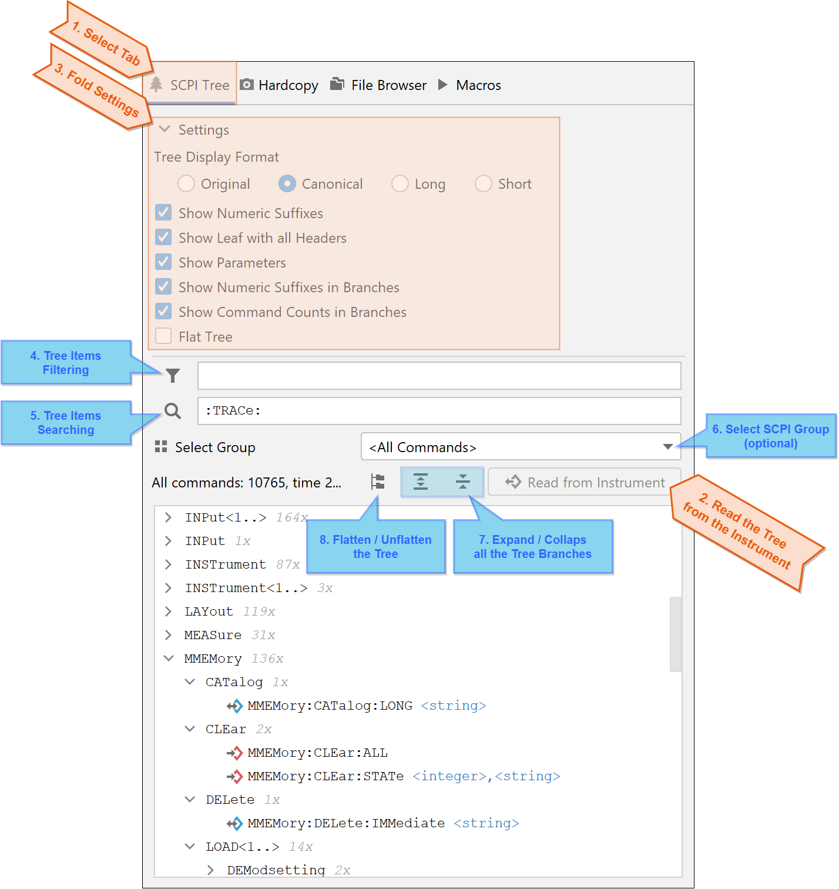
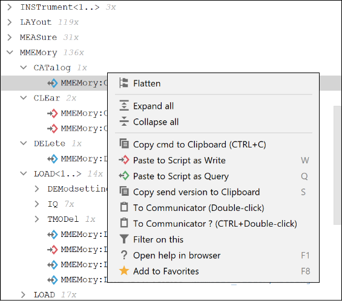

7. Function Panel - SCPI Tree
==============================

SCPI Tree is one tab of the Function Panel that contains multiple features depending on whether they are supported by the instrument.

Description of the controls:

1. **Function Panel SCPI Tree Tab** - select this tab to access SCPI Tree features.
2. **Read Tree from Instrument Button** - requires active connection (see SCPI Communicator). Use it to read the SCPI Tree from the instrument. You only need to do it once. After that, the SCPI Tree is cached in your computer.
3. **Foldable Settings Panel** - settings related to look and feel of the SCPI Tree branches and commands.
4. **Filter Controls** - Filter Toggle button switches the filtering of the tree ON/OFF. Filtering uses a powerful SCPI-syntax tailored engine to filter commands you are searching for. See the filter text tooltip for more details on syntax.
5. **Search Controls** - Search button and the Search Text allow for searching of next element fulfilling the search text. The syntax is the same as for the Filter Text.
6. **Select SCPI Group** - optional list-box, only visible when your instrument supports reading of the SCPI commands per FW Application sub-system (group).
7. **Expand/Collapse all Tree Branches** - expands or collapses all the SCPI Tree branches. Use the context-menu to expand/collapse only certain branch, or certain level.
8. **Flat Tree Toggle** - change the display between tree and flat list.

Each SCPI Tree item has a dedicated menu with many useful actions. Example for a single SCPI Command node:

.. hint::

    After you have read out the SCPI Tree from the instrument, you can use auto-completion feature in the SCPI Communicator field.
    If your instrument supports group commands, the SCPI Communicator field offers only the commands from the **currently selected group**.
    If you want to get all the commands suggested, use the choice ``<All Groups>``.

.. tip::

    Check the tooltip texts for the Filter and Search text fields, they show syntax and examples for the match expressions:
    The filter/search text is a combination of space-separated tokens with logical AND between them:

        - Search for a SCPI part that must follow in this very order: ``CONF:FREQ``
        - Search for SCPI parts regardless of the order: ``CONF FREQ``
        - Search for SCPI parts, anchored at the beginning and at the end: ``:CONF FREQ;``
        - Search for a parameter: ``P>EXT``
        - Search for a SCPI with a parameter: ``ROSCillator P>EXT``
        - Search full text: ``F>quency``

.. tip::
    
    Use Drag&Drop on the SCPI Tree Command nodes to paste write or query snippets directly to your Python Script. If a command is write-only or read-only, the snippet is always chosen correctly. If a command is read/write, the write-form is preferred. To override this, hold **ALT** when start dragging.
