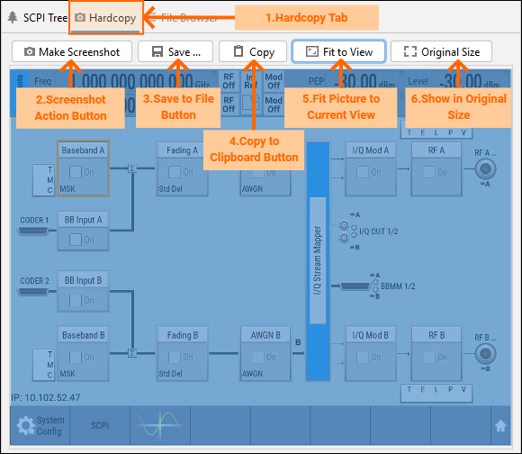

8. Function Panel Hardcopy
===========================

Hardcopy is a function that captures content of the instrument's screen. Our plugin offers that with one click (OK, it could be up to 3 clicks).

Description of the controls:

1. **Function Panel Hardcopy Tab** - select this tab to access Hardcopy features.
2. **Screenshot Action Button** - requires active connection (see SCPI Communicator). If connected, this button starts the screenshot acquisition and transfer to your computer.
3. **Save to File Button** - available after the successful screenshot acquisition, allows saving the picture in **jpg** or **png** format and original size.
4. **Copy to Clipboard Button** - copies the file to Clipboard in original size.
5. **Fit to View** - automatically performed after the successful screenshot acquisition. Adjust the picture size to fit the view with limited width or height. Also does zoom > 1:1.
6. **Show in Original Size** - changes the picture back to the original size and activates the view pane's scroll controls if necessary.
