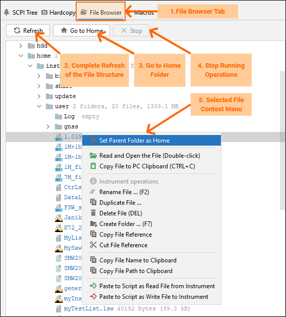

9. Function Panel File Browser
==============================

File browser is a handy feature that allows you to seamlessly copy files between your computer and your instrument, or even between two of your instruments.
The usage is just like your standard file explorer - copy / paste with CTRL+C / CTRL+V, double-click to open the file in Pycharm.
The File Browser also allows for management of the instrument file system - copying, renaming, deleting, moving of files, creating folders...
Check out the items context-menu to see which features are available for which item or group of items.

Description of the controls:

1. **Function Panel File Browser** - select this tab to access File Browser features.
2. **Complete Refresh of the File Structure** - start from the beginning, read fresh file tree from the instrument.
3. **Go to Home Folder** - navigates through the file structure to your home folder. You can change the home folder by right-clicking on the button.
4. **Stop Running Operations** - sometimes reading of folder consist of many small tasks that can take a long time. You can interrupt them with this button.
5. **Selected File Context menu** - Example of the context menu for a single file. The context menu differs for multiple files selection, or a folder selection. Multiple folders selection has no context menu available.
