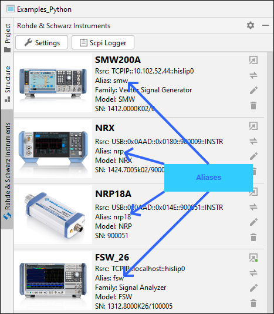
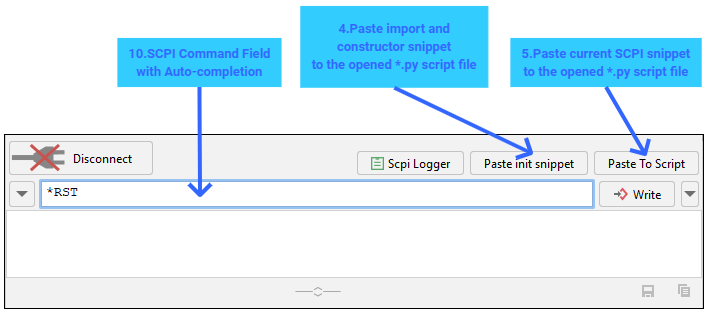
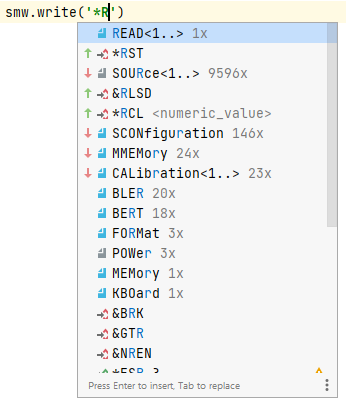
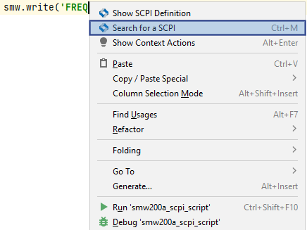
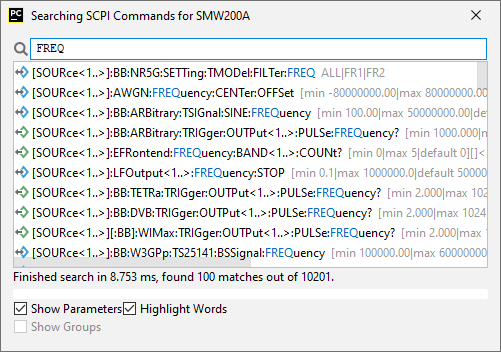

9. Writing Python Script
=========================

.. tip::
    Before you continue with this chapter, we recommend to read out the SCPI Tree of your instrument.
    That will allow you to use SCPI auto-completion in the communicator and in your python script:

    - Open the Instrument Tool Window (:ref:`instrument-tool-window`)
    - Connect to your instrument. (:ref:`SCPI Communicator Field 2<scpi-communicator>`)
    - Use the Field 2 (Read Tree) of the :ref:`function-panel-scpi-tree`

Let us write some python remote-control script for your SMW200A.
First, we import the RsInstrument package and create our SMW object.
The most important value that connect your instrument from the list to your python script is the **ALIAS**, in our case, ``smw``.
This is going to be the script variable name for our object:

.. tip::
    In some cases, where you can not have the alias equal to the script variable name, you can set a default instrument for SCPI Tree.
    This is then used in cases where your script variable name does not fit any instrument alias.
    See the :ref:`settings-scpi-code-completion`.

9.1 SCPI Communicator paste function
"""""""""""""""""""""""""""""""""""""

Once again, the important controls of the SCPI Communicator for the purpose of this chapter:

Use the *Field 4 (Paste Init Snippet)*, to insert for example this code:

.. code-block:: python

    from RsInstrument import *

    smw = RsInstrument('TCPIP::10.102.52.47::hislip0', reset=False)

Next, enter the ``*IDN?`` to the *Field 10*, and hit the *Field 5 (Paste to Script Button)*. You script will look like this:

.. code-block:: python

    from RsInstrument import *

    smw = RsInstrument('TCPIP::10.102.52.47::hislip0', reset=False)
    result = smw.query('*IDN?');

.. tip::
    You can change the format of the pasted code with templates in :ref:`settings-templates`.

9.2 Auto-completion in script
""""""""""""""""""""""""""""""

Another way to write your SCPI script is the SCPI auto-completion feature. SCPI auto-completion works with script call expressions, where the origin object name is your instrument alias,
and the method contains an argument of string-type. Type (do not copy/paste) for example this:

.. tip::
    You can force the auto-completion window to pop up with the keyboard combo **CTRL+SPACE**

9.3 Search in the script
"""""""""""""""""""""""""

The last option is to use right-click context menu:

The already written command is pre-filled to the search box, and you can change or amend it.
**Double-click** on the desired command line in the table to insert it into your script:

