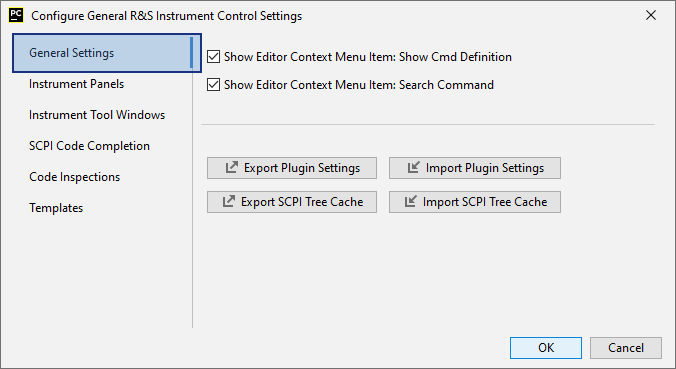
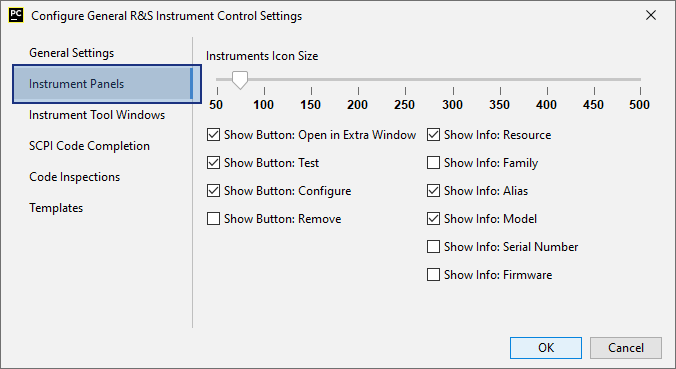
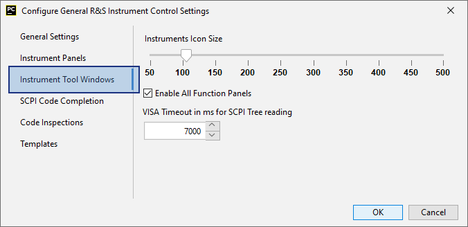
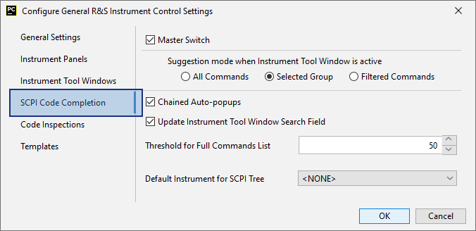
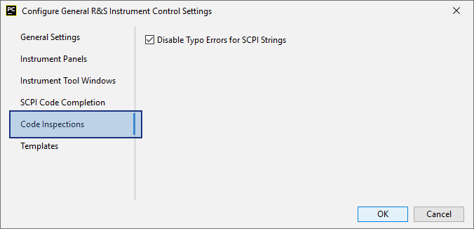
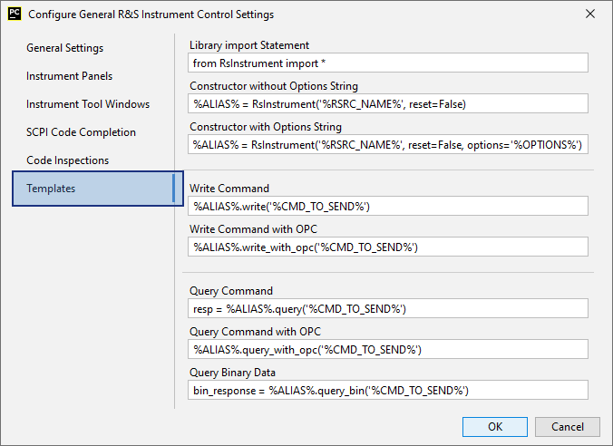

.. _plugin-settings:

10. Plugin Settings
=========================

Here, you can find all the general settings (non-instrument specific) for the plugin.
You can invoke it either from the :ref:`Main Instrument Panel<main-instrument-panel>`,
or the Pycharm menu *File -> Rohde & Schwarz IC Settings*.

10.1 General settings
"""""""""""""""""""""""""""""""""""""""

Contains general settings for the plugin, plus import/export features for stored data.

Description of the controls:

1. **Show Editor Context Menu Item: Show Cmd Definition** - allow for this entry in the script editor right-click context menu.
2. **Show Editor Context Menu Item: Search Command** - allow for this entry in the script editor right-click context menu.
3. **Export Plugin Settings** - Exports all the settings and the instruments list to a xml file.
4. **Import Plugin Settings** - Imports the selected xml file as a plugin settings. You need to restart the IDE afterwards.
5. **Export SCPI Tree Cache** - exports all the cached SCPI Trees to a single zip file. This way you can share or backup all the read-out SCPI Trees without a need to have each instrument physically available.
6. **Import SCPI Tree Cache** - imports the SCPI Trees contained in the selected zip file - copies them into the plugin's cache. Overwrites the existing ones.

10.2 Instrument Panels
"""""""""""""""""""""""

Settings related to the *look-and-feel* of the Instrument Panel List (IPL).
The chapter :ref:`Instrument Panel List<instrument-panel-list>` shows how you can adjust the instrument items.
Names of the fields are self-explanatory.

10.3 Instrument Tool Windows
"""""""""""""""""""""""""""""

Common settings for all the ITWs.

Description of the controls:

1. **Instruments Icon Size** - change the ITW header icon size.
2. **Enable All Function Panels** - overrides the internal table with the information which instrument supports which feature, and enables all the function panels. Use this on you own risk...
3. **VISA Timeout in ms for SCPI Tree reading** - maximum time the plugin waits for the instrument's response when reading the SCPI Tree. You can adjust it higher if your instrument needs more time to respond.

.. _settings-scpi-code-completion:

10.4 SCPI Code Completion
""""""""""""""""""""""""""

Settings related to SCPI auto-completion.

Description of the controls:

1. **Master Switch** - switches the complete SCPI Tree code completion ON or OFF.
2. **Suggestion Mode** - only has effect if the Instrument Tool Window (ITW) is active. If the ITW is inactive, the suggestion mode is always **All Commands**.

    - **All Commands** - always suggest all the available commands.
    - **Selected Group** - suggest only the commands from the currently selected group. If the instrument does not support group commands, this mode has the same effect as **All Commands**.
    - **Filtered Commands** - only suggest the commands that are currently visible in the SCPI Tree Function panel, also taking Filter feature into account.

3. **Chained Auto-popups** - when the SCPI commands suggestion starts, the suggestion popups are invoked automatically until the command is completed.
4. **Update ITW Search Field** - as the auto-completion composes the SCPI command, the :ref:`Find Field 5 in the ITW SCPI Tree<function-panel-scpi-tree>` is updated, which triggers the SCPI Tree item navigation.
5. **Threshold for Full Commands List** - as you are completing the SCPI command, the amount of the possible suggestions decreases. When it falls below this threshold, the suggestions will contain not only the next header, but the full command up to the end.
6. **Default Instrument for SCPI Tree** - there are cases, where you are might use script variables that do not fit any of your instrument's aliases. Such case is for example a common sub-routine serving more than one instrument. If you still want to use the SCPI code completion, you have to tell the RSIC plugin which SCPI Tree to use. You can do it here by defining a default instrument.

10.5 Code Inspections
""""""""""""""""""""""

Settings affecting code inspections. Currently only one feature is supported.

Description of the controls:

1. **Disable Typo Errors for SCPI Strings** - removes the distracting green underlines for all the SCPI strings which highlight typo errors. The typo checking still works for other parts of your script.

.. _settings-templates:

10.6 Templates
""""""""""""""""""""""

All the snippets pasted into your script can be adjusted here. Names of the fields are self-explanatory.

