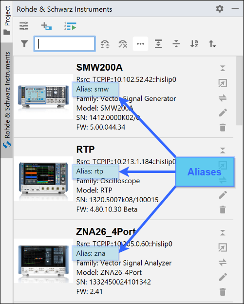
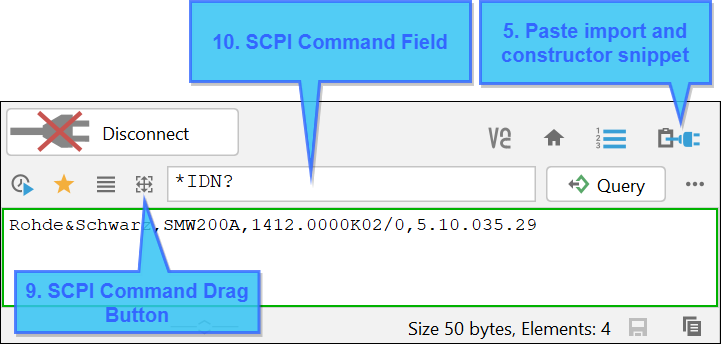
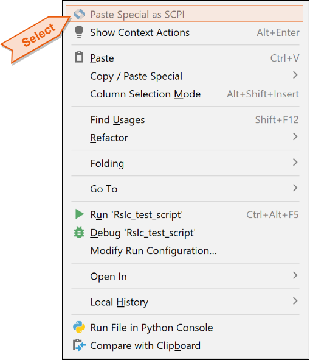
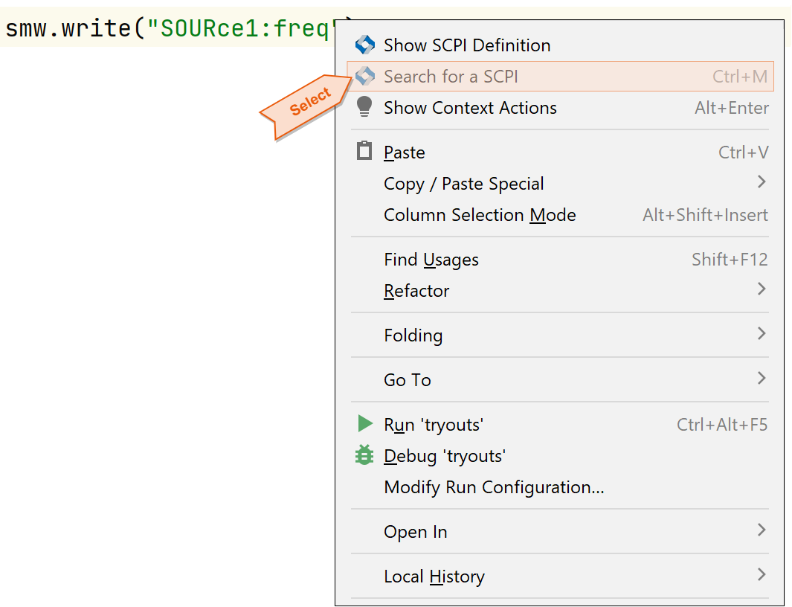
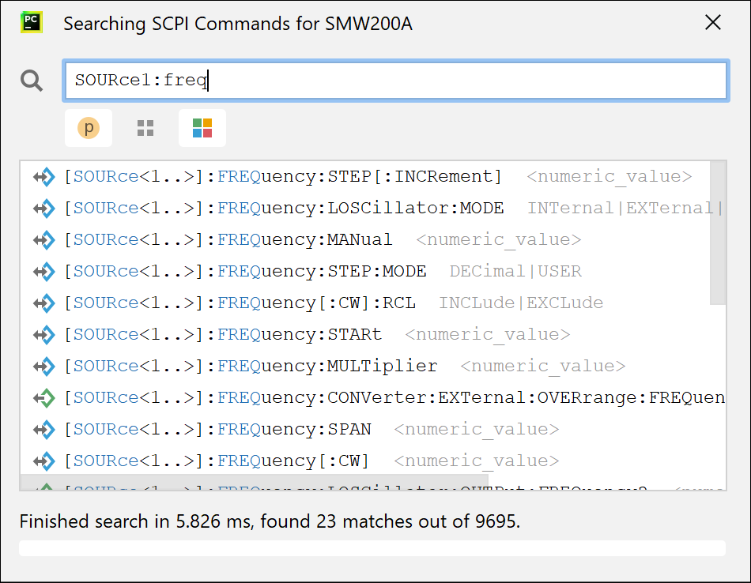

11. Writing Python Script
=========================

.. tip::
    Before you continue with this chapter, we recommend to read out the SCPI Tree of your instrument.
    That will allow you to use SCPI auto-completion in the communicator and in your python script:

    - Open the Instrument Tool Window (:ref:`6. Instrument Tool Window`)
    - Connect to your instrument. (:ref:`SCPI Communicator Field 1<scpi-communicator>`)
    - Use the Field 2 (Read from Instruemnt) of the :ref:`7. Function Panel - SCPI Tree`

Let us write some python remote-control script for your SMW200A.
First, we import the RsInstrument package and create our SMW object.
The most important value that binds your instrument from the list to your python script is the **ALIAS**, in our case, ``smw``.
This is going to be the script variable name for our object:

.. tip::
    In some cases, where you cannot have the alias equal to the script variable name, you can set a **Default Instrument for SCPI Tree**.
    This is then used in cases where your script variable name does not fit any instrument alias.
    See the :ref:`settings-scpi-code-completion`.

11.1 SCPI Communicator paste function
"""""""""""""""""""""""""""""""""""""

Once again, the important controls of the SCPI Communicator for the purpose of this chapter:

Use the *Field 4 (Paste Init Snippet)*, to insert for example this code:

.. code-block:: python

    from RsInstrument import *

    smw = RsInstrument('TCPIP::10.102.52.47::hislip0', reset=False)

Next, enter the ``*IDN?`` to the *Field 11*, and hit the *Field 5 (Paste to Script Button)*. You script will look similar to this:

.. code-block:: python

    from RsInstrument import *

    smw = RsInstrument('TCPIP::10.102.52.47::hislip0', reset=False)
    result = smw.query('*IDN?');

.. tip::
    You can change the format of the pasted code with templates in :ref:`settings-templates`.

11.2 Auto-completion in script
""""""""""""""""""""""""""""""

Another way to write your SCPI script is the SCPI auto-completion feature. SCPI auto-completion works with script call expressions, where the origin object name is your instrument alias,
and the method contains an argument of string-type. Type (do not copy/paste) for example this:

.. image:: images/script_autocomplete_suggestions.png

Select your desired command and use **TAB** to insert it. Pycharm immediately shows you another part of the command to auto-complete.

.. tip::
    You can force the auto-completion window to pop up with the keyboard combo **CTRL+SPACE**

11.3 Pasting from plain SCPI-scripts
""""""""""""""""""""""""""""""""""""

If you have a list of SCPI commands from another source, for example from our user manuals, you can paste the line in you script as write/query snippets. Let us take the following R&S FSW example of setting one measurement channel:

.. code-block:: console

    *RST
    INSTrument:CREate:NEW IQ,'IQ 1'
    SENS:SWEEP:COUNT 6
    DISP:TRAC1:MODE BLANK
    DISP:TRAC2:MODE MAXH
    DISP:TRAC3:MODE MINH
    INIT:CONT OFF
    INST:SEL 'Spectrum';*WAI
    SENSe:SWEep:MODE ESPectrum
    SENSe:ESPectrum:PRESet:STANdard 'WCDMA\3GPP\DL\3GPP_DL.xml'
    SENS:SWEEP:COUNT 5

Copy the lines into your clipboard, right-click in your script, and select the item **Paste Special as SCPI**:

Select between the call type with/without OPC and select the target instrument type (or select a custom name).
This generates the following python script:

.. code-block:: python

    fsw.write("*RST")
    fsw.write("INSTrument:CREate:NEW IQ,'IQ 1'")
    fsw.write("SENS:SWEEP:COUNT 6")
    fsw.write("DISP:TRAC1:MODE BLANK")
    fsw.write("DISP:TRAC2:MODE MAXH")
    fsw.write("DISP:TRAC3:MODE MINH")
    fsw.write("INIT:CONT OFF")
    fsw.write("INST:SEL 'Spectrum';*WAI")
    fsw.write("SENSe:SWEep:MODE ESPectrum")
    fsw.write("SENSe:ESPectrum:PRESet:STANdard 'WCDMA\3GPP\DL\3GPP_DL.xml'")
    fsw.write("SENS:SWEEP:COUNT 5")

11.4 Search in the script
"""""""""""""""""""""""""

Another option is to use right-click context menu. Right-click when your caret is placed between quotes in a method with first string parameter:

The already written command is pre-filled to the search box, and you can change or amend it.
**Double-click** on the desired command line in the table to insert it into your script:

