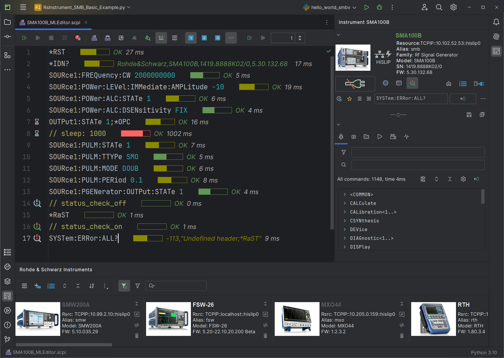

RsIC Documentation
===================

See the SCPI Recorder feature in action:

.. raw:: html

    <iframe width="560" height="315" src="https://www.youtube.com/embed/pURxIsOwRBI?rel=0" frameborder="0" allowfullscreen></iframe>
	

.. include:: Readme.rest
.. include:: Chapter_01_Introduction.rest
.. include:: Chapter_02_Installation.rest
.. include:: Chapter_03_MainPanel.rest
.. include:: Chapter_04_AddingFirstInstrument.rest
.. include:: Chapter_05_InstrumentsPanelList.rest
.. include:: Chapter_06_InstrumentsToolWindow.rest
.. include:: Chapter_07_FunctionPanel_ScpiTree.rest
.. include:: Chapter_08_FunctionPanel_Hardcopy.rest
.. include:: Chapter_09_FunctionPanel_FileBrowser.rest
.. include:: Chapter_10_FunctionPanel_Macros.rest
.. include:: Chapter_11_FunctionPanel_ScpiRecorder.rest
.. include:: Chapter_12_FunctionPanel_Curves.rest
.. include:: Chapter_13_PlainScpiScripts.rest
.. include:: Chapter_14_WritingPythonScripts.rest
.. include:: Chapter_15_AdvancedScpiParser.rest
.. include:: Chapter_16_PluginSettings.rest

Indices and tables
==================

* :ref:`genindex`
* :ref:`modindex`
* :ref:`search`
